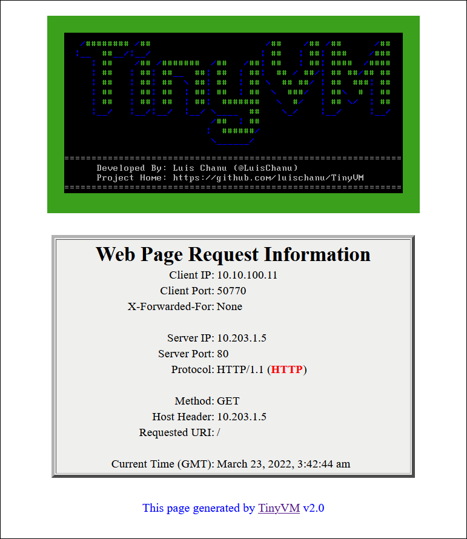

```
 /######## /##                     /##    /## /##      /##
|__  ##__/|__/                    | ##   | ##| ###    /###
   | ##    /## /#######  /##   /##| ##   | ##| ####  /####               Created by
   | ##   | ##| ##__  ##| ##  | ##|  ## / ##/| ## ##/## ##          -----------------------
   | ##   | ##| ##  \ ##| ##  | ## \  ## ##/ | ##  ###| ##               Luis Chanu
   | ##   | ##| ##  | ##| ##  | ##  \  ###/  | ##\  # | ##          VCDX #246 & NSX vExpert
   | ##   | ##| ##  | ##|  #######   \  #/   | ## \/  | ##
   |__/   |__/|__/  |__/ \____  ##    \_/    |__/     |__/
                         /##  | ##                        
                        |  ######/                        
                         \______/                         

                        Version 2.0

```


# Table of Contents

* [Description](#description)
  * [TinyVM Web Page](#tinyvm-web-page)
* [VM Details](#vm-details)
  * [Virtual Hardware](#virtual-hardware)
  * [VM Options](#vm-options)
  * [Software](#software)
* [Product Features](#product-features)
  * [Static IPv4 Address Configuration](#static-ipv4-address-configuration)
* [TinyVM Download](#tinyvm-download)
* [Version History](#version-history)
* [Credits](#credits)


# Description
TinyVM was born out of a desire by [Luis Chanu](https://www.linkedin.com/in/luischanu/) to have a portable VM with a small resource footprint that could be used to easily test/verify load balancing and assist in basic network bandwidth testing using [iPerf3](https://iperf.fr/).  Additionally, as a co-developer of [SDDC.Lab](https://github.com/rutgerblom/SDDC.Lab), Luis thought TinyVM could serve to demonstrate the WorkloadVM functionality that he added to that project.

TinyVM is based on [Tiny Core Linux](http://www.tinycorelinux.net/), and obtains its IPv4 address via DHCP.  It includes a http web server that displays its IP and MAC addresses on a web page that has a border color that is randomly chosen at each VM startup.  This random color helps aid the user's identification of the various VMs when load balance testing is being performed.

As part of the VM power-on process, it also automatically starts an iPerf3 server, which iPerf3 clients can then target to perform bandwidth testing.


## TinyVM Web Page

Here is an example of the web page that TinyVM generates:
<p align="center">

</p>

# VM Details

TinyVM is built in a vSphere environment, and exported to an [Open Virtualization Format](https://en.wikipedia.org/wiki/Open_Virtualization_Format), and packaged in an [Open Virtual Appliance](https://en.wikipedia.org/wiki/Open_Virtualization_Format), or OVA, package.


## Default User Credentials

TinyVM is built with the following default user credentials:

| Username | Password |
|----------|----------|
| tc       | VMware1! |
| root     | VMware1! |


## Virtual Hardware

TinyVM is provisioned with the following Virtual Hardware configuration:

| Virtual Hardware | Setting/Configuration                    | Notes/Comments |
|------------------|------------------------------------------|-------------------------------------------------------------------|
| CPU              | 1                                        | Enabled "Expose hardware assisted virtualization to the guest OS" |
| Memory           | 192 MB                                   | |
| Hard Disk        | 80 MB                                    | Using IDE(0:0) |
| Network Adapter  | Connect To DHCP Enabled Network Segment  | Adapter Type: VMXNET3 |
| CD/DVD Drive     | Client Device                            | Using IDE(0:1) |
| SCSI Controller  | *** DELETED ***                          | |
| Compatibility    | ESXi 5.5 and later (VM Hardware version 10) | This permits it to be imported into just about any environment |


## VM Options

TinyVM is provisioned with the following VM Options:

| VM Option        | Setting/Configuration                    | Notes/Comments |
|------------------|------------------------------------------|----------------|
| Guest OS Family  | Linux                                    | |
| Guest OS Version | Other 3.x or later Linux (32-bit)        | |


## Software

TinyVM was built with the following software:
 * [Tiny Core Linux version 13.0 (Core)](http://www.tinycorelinux.net/)
 * [IPv6 NetFilter](https://www.netfilter.org/) (Provides IPv6 support)
 * [Open-VM-Tools](https://github.com/vmware/open-vm-tools)
 * [OpenSSH](https://www.openssh.com/)
 * [TCPDump](https://www.tcpdump.org/)
 * [NGINX](https://www.nginx.com/)
 * [iPerf3](https://iperf.fr/)
 * [pcre2](https://www.pcre.org/) (Required by PHP-FPM)
 * [pcre](https://www.pcre.org/) (Required by Open-VM-Tools)
 * [curl](https://curl.se/)
 * [wget](https://www.gnu.org/software/wget/)


# Product Features

## Static IPv4 Address Configuration

By default, TinyVM obtains it's IPv4 address via DHCPv4.  However, you can now assign a static IPv4 address to TinyVM.  Should you assign a static IPv4 address to TinyVM, and later decide you want to revert it back to using DHCPv4, you will need to redeploy it from the OVA file as there is no "undo" to this feature.

To assign an IPv4 address to TinyVM, follow these steps:

1. Deploy TinyVM from the OVA file.
2. Login to TinyVM from either the console or via a SSH session.
3. To assign the static IPv4 address, run the following command:
```
sudo /opt/set-ipv4-address.sh <IPv4Address> <SubnetMask> <BroadcastAddress> <DefaultGateway> <DNSServer> <DNSDomain>

  where:
      <IPv4Address>.......is the static IPv4 address to set the eth0 interface to
      <SubnetMask>........is the subnet mask in dot decimal notation (i.e. 255.255.255.0)
      <BroadcastAddress>..is the IPv4 subnet broadcast address
      <DefaultGateway>....is the IPv4 gateway that should be used for all off-net destinations
      <DNSServer>.........is the IPv4 address of the DNS server to use to resolve names
      <DNSDomain>.........is the default DNS search domain to use

You can also get help on the above command by entering just the command without any arguments.
```
4. Once the static IPv4 address is applied, you will see a message indicating that ```TinyVM WILL RESTART IN 5 SECONDS```, at which point TinyVM will restart.

5. TinyVM is now configured to use a static IPv4 address.  This address will be persistent, and survive across reboots/restarts.

6. One other enhancement made to TinyVM v1.4 is that the startup screen now indicates the method by which the IPv4 has been assigned: DHCP or static.  The table below indicates the startup message for each method.

| IPv4 Obtained Via | Startup Message Will State |
|:------------:|-----------------|
| DHCP | Your DHCP IPv4 address is: 10.20.30.100 |
| Static | Your static IPv4 address is: 10.20.30.100 |

## IPv6 Support
TinyVM is now dual-stacked (IPv4/IPv6), and responds to either IP protocol version.


# TinyVM Download

TinyVM.ova can be found in the ```images``` directory.

If you do not see an ```images``` directory, then you are in a develpment branch, and the OVA is not yet available.  Please look at a previous branch version for a released OVA.


# Version History

## Version 1.0
* Internal testing
* Never released to the public

## Version 1.1
* Internal testing
* Never released to the public

## Version 1.2
* Released 10-MAR-2022
* Intial public release of TinyVM

## Version 1.3
* Released 11-MAR-2022
* Added login banner to display IPv4 address

## Version 1.4
* Released 12-MAR-2022
* Added the ability to statically assign IPv4 address to TinyVM
* Modified login banner indicate if the IPv4 address is assigned via DHCP or static

## Version 1.5
* Released 15-MAR-2022
* Had to increase the VM's provisioned resources to support additional features
* Renamed the script to set static IPv4 address from ```/opt/set-ip-address.sh``` to ```/opt/set-ipv4-address.sh```
* IPv6 support added to VM.  See note in [IPv6 Support](#ipv6-support) section above on current limitations
* IPv6 address information, for both Link-local and Global addresses, has been added to the login banner
* Although the web server itself does not support IPv6, the web page has been updated to display the IPv6 address information
* Small notice added to the bottom of the web page indicating that the page was generated by [TinyVM](https://github.com/luischanu/TinyVM)
* Ran into issue where IPv6 addresses were taking a while to register with the OS, so needed to add some delays.  Thus, you may notice a small delay when logging into the VM due to additional delay that was added to ensure IPv6 has time to be noticed by the OS.
* Due to same IPv6 issues, had to introduce delay for startup of the web server.  Thus, after the VM starts, the website will not be available for a minute (or so) while we allow IPv6 to be fully installed and ready for use.

## Version 2.0
* Released 22-MAR-2022
* Replaced Busybox-httpd web server with NGINX
* Enabled full dual-stack (IPv4 and IPv6) support
* Web page converted from a static page to a PHP dynamic page that is updated with each request
* Added various web session specific information to the web page, including:
  * Client Port
  * X-Forwarded-For
  * Server Port
  * Server Protocol
  * HTTP Method
  * Host Header
  * Requested URI
  * Current Time (GMT)


# Credits
While searching for other similar VMs, [Luis Chanu](https://www.linkedin.com/in/luischanu/) came across a couple of articles that inspired him and gave him some ideas, so he thought he would mention them here.  So, a big thank you goes out to the following people for their articles:
* [Maciej Jedrzejczyk](https://cloudarchitectblog.wordpress.com/about/) at [cloudarchitectblog](https://cloudarchitectblog.wordpress.com) for his [How to build your own yVM: step-by-step process](https://cloudarchitectblog.wordpress.com/2015/11/11/how-to-build-your-own-yvm-step-by-step-process/) article.
* [Sheng Chen](https://route179.dev/about/) at [Route179](https://route179.dev/) for his [Create a Tiny Core Linux VM Template for vSphere Lab environment](https://route179.dev/2021/02/21/create-a-tiny-core-linux-vm-template-for-vsphere-lab-environment/) article.
