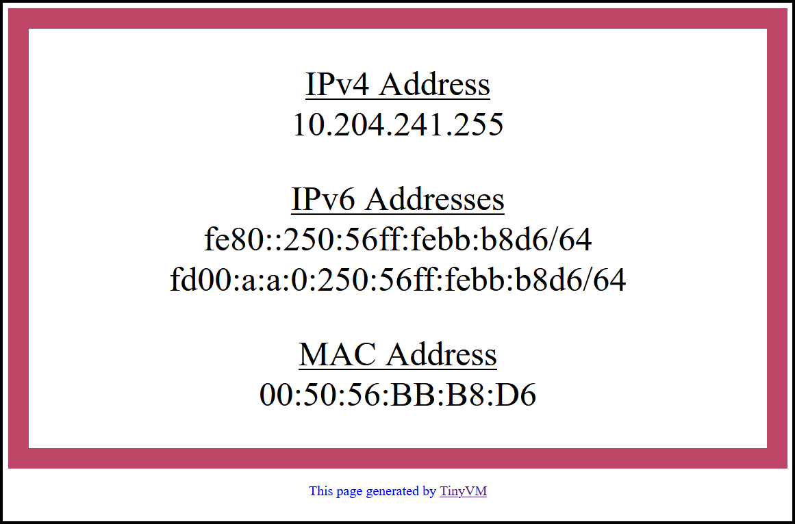

```
 /######## /##                     /##    /## /##      /##
|__  ##__/|__/                    | ##   | ##| ###    /###
   | ##    /## /#######  /##   /##| ##   | ##| ####  /####                  Created by
   | ##   | ##| ##__  ##| ##  | ##|  ## / ##/| ## ##/## ##             -----------------------
   | ##   | ##| ##  \ ##| ##  | ## \  ## ##/ | ##  ###| ##                  Luis Chanu
   | ##   | ##| ##  | ##| ##  | ##  \  ###/  | ##\  # | ##             VCDX #246 & NSX vExpert
   | ##   | ##| ##  | ##|  #######   \  #/   | ## \/  | ##
   |__/   |__/|__/  |__/ \____  ##    \_/    |__/     |__/
                         /##  | ##                        
                        |  ######/                        
                         \______/                         

```


# Table of Contents

* [Description](#description)
  * [TinyVM Web Page](#tinyvm-web-page)
* [VM Details](#vm-details)
  * [Virtual Hardware](#virtual-hardware)
  * [VM Options](#vm-options)
  * [Software](#software)
* [Version History](#version-history)
* [Credits](#credits)


# Description
TinyVM was born out of a desire by [Luis Chanu](https://www.linkedin.com/in/luischanu/) to have a portable VM with small resource footprint that could be used to easily test/verify load balancing and assist in basic network bandwidth testing using [iPerf3](https://iperf.fr/).  Additionally, as a co-developer of [SDDC.Lab](https://github.com/rutgerblom/SDDC.Lab), Luis throught TinyVM could serve to demonstrate the WorkloadVM functionality that he added to that project.

TinyVM is based on [Tiny Core Linux](http://www.tinycorelinux.net/), and obtains its IPv4 address via DHCP.  It includes a http web server that displays its IPv4 and MAC addresses on a web page that has a border color that is randomly chosen at each VM startup.  This random color helps aid the user's identification of the various VMs when load balance testing is being performed.

As part of the VM power-on process, it also automatically starts an iPerf3 server, which iPerf3 clients can then target to perform bandwidth testing.


## TinyVM Web Page

Here is an example of the web page that TinyVM generates:
<p align="center">

</p>

# VM Details

TinyVM is built in a vSphere environment, and exported to an [Open Virtualization Format](https://en.wikipedia.org/wiki/Open_Virtualization_Format), and packaged in an [Open Virtual Appliance](https://en.wikipedia.org/wiki/Open_Virtualization_Format), or OVA, package.


## Default User Credentials

TinyVM is built with the following default user credentials:

| Username | Password |
|----------|----------|
| tc       | VMware1! |
| root     | VMware1! |


## Virtual Hardware

TinyVM is provisioned with the following Virtual Hardware configuration:

| Virtual Hardware | Setting/Configuration                    | Notes/Comments |
|------------------|------------------------------------------|-------------------------------------------------------------------|
| CPU              | 1                                        | Enabled "Expose hardware assisted virtualization to the guest OS" |
| Memory           | 172 MB                                   | |
| Hard Disk        | 48 MB                                    | Using IDE(0:0) |
| Network Adapter  | Connect To DHCP Enabled Network Segment  | Adapter Type: VMXNET3 |
| CD/DVD Drive     | Client Device                            | Using IDE(0:1) |
| SCSI Controller  | *** DELETED ***                          | |
| Compatibility    | ESXi 5.5 and later (VM Hardware version 10) | This permits it to be imported into just about any environment |


## VM Options

TinyVM is provisioned with the following VM Options:

| VM Option        | Setting/Configuration                    | Notes/Comments |
|------------------|------------------------------------------|----------------|
| Guest OS Family  | Linux                                    | |
| Guest OS Vesrion | Other 3.x or later Linux (32-bit)        | |


## Software

TinyVM was built with the following software:
 * [Tiny Core Linux version 13.0 (Core)](http://www.tinycorelinux.net/)
 * [Open-VM-Tools](https://github.com/vmware/open-vm-tools)
 * [OpenSSH](https://www.openssh.com/)
 * [Busybox-httpd](https://www.busybox.net/)
 * [TCPDump](https://www.tcpdump.org/)
 * [iPerf3](https://iperf.fr/)
 * [curl](https://curl.se/)
 * [wget](https://www.gnu.org/software/wget/)


# Version History

| Date | Revision | Revisions / Changes |
|------|----------|---------------------|
| N/A | 1.0 | Internal testing - Never released |
| N/A | 1.1 | Internal testing - Never released |
| 9-MAR-2022 | 1.2 | Initial Release |


# Credits
While searching for other similar VMs, [Luis Chanu](https://www.linkedin.com/in/luischanu/) came across a couple of articles that inspired him and gave him some ideas, so he thought he would mention them here.  So, a big thank you goes out to the following people for their articles:
* [Maciej Jedrzejczyk](https://cloudarchitectblog.wordpress.com/about/) at [cloudarchitectblog](https://cloudarchitectblog.wordpress.com) for his [How to build your own yVM: step-by-step process](https://cloudarchitectblog.wordpress.com/2015/11/11/how-to-build-your-own-yvm-step-by-step-process/) article.
* [Sheng Chen](https://route179.dev/about/) at [Route179](https://route179.dev/) for his [Create a Tiny Core Linux VM Template for vSphere Lab environment](https://route179.dev/2021/02/21/create-a-tiny-core-linux-vm-template-for-vsphere-lab-environment/) article.
